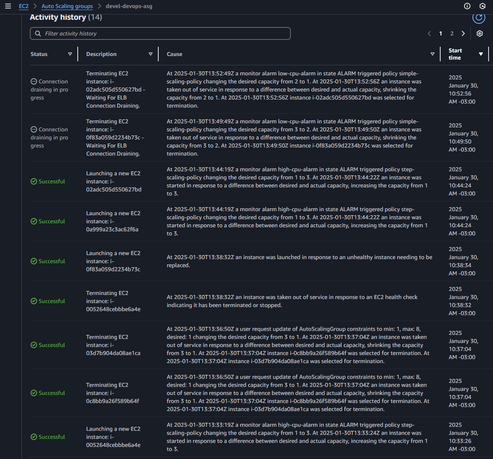

# PeeX task: AWS: Control scaling parameters for virtual machines

## Launch template
## Asg attached to LB
## Dinamic policies
* Step scaling policy

Will scale down one vm if the acerage cpu utilization goes below 20%

* Simple scaling policy

    Has 2 steps:

    - If the cpu averrage goes beyon 75% will launch 2 vm
    - If the cpu average goes below 75% will terminate 1 vm

## Activity of the ASG

## Scheduled action

* scale up in the morning
* scale down in the evening
